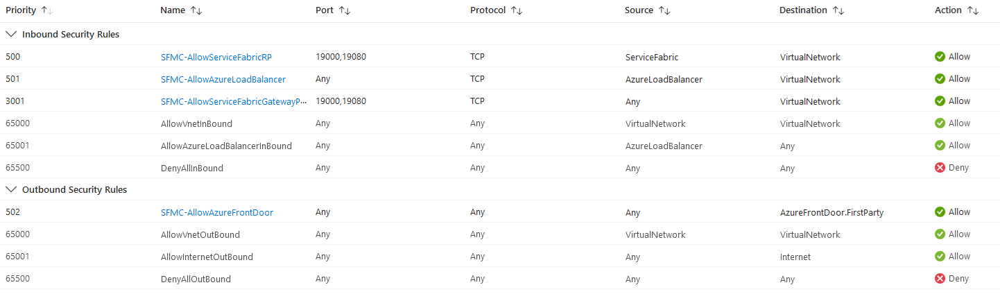

# ManagedServiceFabric
Sample ARM templates and PowerShell scripts for Service Fabric Managed Clusters

## Background
By default a Service Fabric Managed Cluster will create its own load balancer and virtual network during deployment to support the nodes in the cluster. As documented [here](https://learn.microsoft.com/en-us/azure/service-fabric/how-to-managed-cluster-networking) you can configure a Service Fabric Managed Cluster to use an existing virtual network and / or an existing load balancer. Originally, when using the bring your own virtual network option, all node types were placed in the same subnet. Recent changes, documented [here](https://learn.microsoft.com/en-us/azure/service-fabric/how-to-managed-cluster-deploy-with-subnet-per-nodetype), now allow you to deploy a Service Fabric Managed Cluster with a subnet per node type. The sample ARM templates and PowerShell scripts included in this repository will assist in creating a Service Fabric Managed Cluster where each node type is assigned to a different subnet in an existing virtual network. The primary node type hosting the Service Fabric system services will use the default load balancer created by the Service Fabric Managed Cluster deployment while the secondary node types hosting the deployed applications will use an existing load balancer.

## Pre-requisites ##
- A virtual network with a subnet for the primary node type and a subnet for the secondary node type
- An Azure Load Balancer for the secondary node type. The create-lb.json ARM template can be used to create this Azure Load Balancer.
- A Network Security Group containing the following rules and assigned to the subnets that will host the primary and secondary node types.

## Scripts and Templates
### create-lb.json
This ARM template will create a Standard SKU Azure Load Balancer for use with the secondary node types of the Service Fabric Managed Cluster

**Parameters**
- dnsName - The DNS name that will be used for the Azure Load Balancer

### set-lb-role.ps1
This PowerShell script will grant the Service Fabric Resource Provider the Network Contributor role on the Azure Load Balancer that will be used by the secondary node types.

**Parameters**
- subscriptionId - Your subscription ID
- resourceGroupName - The name of the resource group containing the Azure Load Balancer
- loadBalancerName - The name of the Azure Load Balancer

**Outputs**
- LoadBalancerBackendPoolId
- LoadBalancerNatPoolId

### set-vnet-role.ps1
This PowerShell script will grant the Service Fabric Resource Provider the Network Contributor role on the subnets of the virtual network that will host the nodes.

**Parameters**
- subscriptionId - Your subscription ID
- resourceGroupName - The name of the resource group containing the virtual network
- VirtualNetworkName - The name of the virtual network

**Outputs**
- NodeType1SubnetId
- NodeType2SubnetId

### template.json ###
This ARM template will create a Service Fabric Managed Cluster using an existing virtual network with a subnet for each node type. The default Azure Load Balancer created by the Service Fabric Managed Cluster deployment will be used for the primary node type and a separate Azure Load Balancer will be used for the secondary node type.

**Parameters**

- managedClusters_sf_name - The name of the Service Fabric Managed Cluster
- region - The Azure region where the resources will be deployed
- adminUserName - The name of the admin user for the nodes
- adminPassword - The password of the admin user for the nodes
- thumbprint - The thumbprint of the client certificate
- nodeType1SubnetId - The subnet ID of the subnet for the primary node type
- nodeType2SubnetId - The subnet ID of the subnet for the secondary node type
- nodeType1VmSize - The VM size of the primary node type
- nodeType1VmSize - The VM size of the secondary node type
- publicLoadBalancerBackendPoolId - The backend pool ID of the load balancer for the secondary node type
- publicLoadBalancerNatPoolId - The NAT pool ID of the load balancer for the secondary node type
